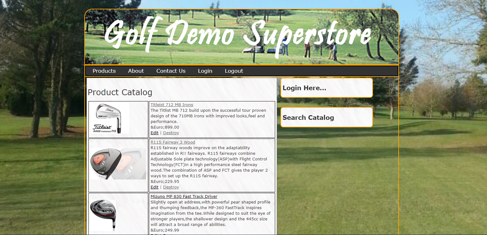

# Demo Golfstore Rails App

A basic REST API example for performing CRUD functions with user authentication and shopping cart functionality.

## Tech Stack

- **Rails**: 7.1.6 (LTS)
- **Ruby**: 3.2.3
- **Database**: SQLite3
- **App Server**: Puma 6.6.1

## Features

- Basic User login/logout functionality
- Shopping cart management
- Product catalog with CRUD operations
- REST API endpoints

## Prerequisites

- Ruby 3.2.3
- Bundler 2.0+

## Installation & Setup

### 0. Setup PATH (First Time Only)

Add the Ruby gem directory to your PATH so the `bundle` command works:

```bash
echo 'export PATH="$HOME/.gem/ruby/3.2.0/bin:$PATH"' >> ~/.bashrc
source ~/.bashrc
```

Verify it works:
```bash
bundle --version
```

### 1. Install Dependencies

```bash
bundle install
```

**Note**: If you encounter permission issues, run:
```bash
bundle config set --local path "vendor/bundle"
bundle install
```

### 2. Setup Database

Create and initialize the database:

```bash
bundle exec rails db:create
bundle exec rails db:migrate
```

### 3. Run the Server

Start the Rails development server:

```bash
bundle exec rails server
```

Or with custom host/port (recommended):

```bash
bundle exec rails server -b 0.0.0.0 -p 3000
```

If the workspace path contains spaces (or Spring causes issues), disable Spring:

```bash
export DISABLE_SPRING=true
bundle exec rails server
```

**Full startup command (with all options):**
```bash
cd "/path/to/golfstore-master"
export PATH="$HOME/.gem/ruby/3.2.0/bin:$PATH"
export DISABLE_SPRING=true
bundle exec rails s -b 0.0.0.0 -p 3000
```

### 4. Access the Application

Once the server is running, open your browser and navigate to:

- **Home/Products**: http://localhost:3000/
- **Product Catalog**: http://localhost:3000/items
- **About Page**: http://localhost:3000/about
- **Contact Page**: http://localhost:3000/contact
- **Shopping Cart**: http://localhost:3000/cart
- **Admin Login**: http://localhost:3000/Admin

#### Testing Features:

1. **Browse Products**: View all 10 golf products with images and prices
2. **Search Products**: Use the search box to filter by product name, brand, category, or description
3. **Add to Cart**: Click "Add to Cart" on any product to add it to your shopping cart
4. **View Cart**: Navigate to `/cart` to see items and quantities
5. **Admin Login**: Click the green "Admin Login" button (demo session login)
6. **Logout**: Click "Logout" to clear the session

#### Example Workflow:
```
1. Visit http://localhost:3000/
2. Search for "driver" in the Search Catalog box
3. Click on "Pro Tour Golf Driver"
4. Click "Add to Cart"
5. Click "Products" to continue shopping
6. Add another item to cart
7. Visit /cart to see your items
```

## API Routes

- **Home**: `/` → Product listing
- **Products**: `/items` (GET list, POST create, PATCH/PUT update, DELETE destroy)
- **Product Details**: `/items/:id` (GET show)
- **Cart**: `/cart` → View cart contents
- **Add to Cart**: `/cart/:id` → Add product to cart
- **Clear Cart**: `/cart/clear` → Empty the cart
- **User**: `/Admin` → Admin login (demo)
- **Logout**: `/logout` → Clear session
- **Site Pages**: `/about`, `/contact` → Information pages

## Running Tests

Unit and integration tests:

```bash
bundle exec rails test
```

### Manual Testing (Browser)

After starting the server with `bundle exec rails server`:

1. **Product Catalog** - Visit `http://localhost:3000/`
   - Browse 10 golf products with images, prices, and descriptions
   - Click product names or images to view details

2. **Search** - Use the "Search Catalog" box
   ```
   Try searching: "driver", "golf", "pro", "taylor", etc.
   ```
   
3. **Shopping Cart** - Add products and view cart
   ```
   1. Click "Add to Cart" on any product
   2. Visit http://localhost:3000/cart to see items
   3. Quantity increments if you add the same item twice
   ```

4. **Navigation** - Test all menu links
   ```
   - Products → /items
   - About → /about
   - Contact → /contact
   - Admin Login → /Admin
   - Logout → /logout
   ```

5. **Responsive Design** - Test on different screen sizes
   - Desktop, tablet, mobile views supported
   - Sidebar with search and login boxes
   - Product grid layout

## Structure

- `app/controllers/` - Request handlers for REST API
- `app/models/` - Data models (Item, User, Cart)
- `app/views/` - HTML/ERB templates
- `app/assets/` - CSS, JavaScript, and images
- `db/` - Database schema and migrations

## Images



## Migration from Rails 5 → 7.1

This application has been upgraded from Rails 5.0 to Rails 7.1.6 for compatibility with modern Ruby versions. Key changes:

- Updated all gem dependencies to Rails 7.1 compatible versions
- Fixed deprecated initializers (`new_framework_defaults.rb`)
- Configured bundler to use local gem directory (`vendor/bundle`)
- All routes and controllers verified for compatibility
